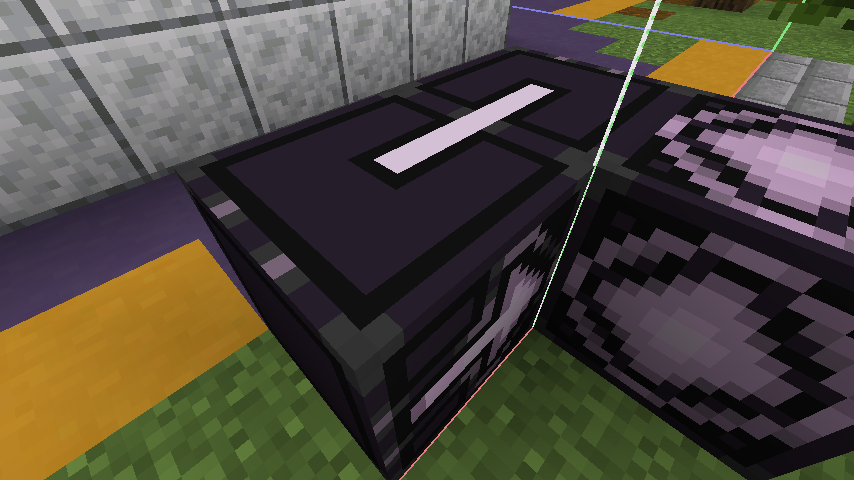

本文旨在于介绍如何制作能够改变世界生成的数据包。本文将包括以下方面的教程：

- 自定义结构
- 自定义地物(feature)
- 自定义生物群系(biome)
- 自定义维度

同时本文还将介绍进度与战利品表数据包的基本编写方法。

本文提到的数据包编辑器可以在这里找到：[链接](https://misode.github.io/)

---

### 自定义结构

#### 结构NBT的创建

自定义结构需要有结构NBT文件配套支持才能正常使用，我们首先介绍如何获得结构NBT文件。
1. 首先，我们需要清理准备在世界中生成的结构，应当尽可能将无关的方块拆除，然后如果想让结构内部空气方块可以被其他方块替换，你需要用结构虚空(minecraft:structure_void)替换其中的空气方块。这可以手工完成，也可以使用/fill指令完成，由于指令教学不是本文的重点，因此请读者自行查询[wiki](https://zh.minecraft.wiki/w/%E5%91%BD%E4%BB%A4/fill)。

2. 对整个结构进行划分。由于结构方块限制结构只能保存最大48x48x48大小的结构，因此应当将结构划分成小于此尺寸的若干部分，并使用[拼图方块](https://zh.minecraft.wiki/https://zh.minecraft.wiki/w/%E6%8B%BC%E5%9B%BE%E6%96%B9%E5%9D%97)进行连接。拼图方块的用途是从模板池中选其中一结构拼接，产生随机拼接的结构。本文使用的模板池只有一个结构模板，因此不涉及随机拼接。结构模板的介绍见下一部分。

    

    如上图所示，这是两个拼接在一起的拼图方块。图中拼图方块顶部的材质对上即可。左边的拼图方块属于先生成的结构，因此生成结构的时候会先解析左边的拼图方块的内容。目标池字段在此填写右边的结构所在的模板池即可。然后名称随意填，目标名称也随意填，但要注意右侧拼图方块的名称字段应当和左侧方块的目标名称字段一致，这样才能正确找到对应的拼图方块。其他选项在本次教程中用不到，无需关注。另外有一点需要说明，一个结构中可以包含多个拼图方块，他们会分别找到对应的拼图（或者找不到，或者达到最大深度（以前是7，目前快照是20，因此结构不宜过大过复杂），并终止生成）并放置，不一定要在结构边界。y方向放置的拼图方块会有额外的“允许旋转”的选项。

    然后我们在结构方块中保存结构。结构名可以指定命名空间，格式为*namespace:name*，结构会保存到当前存档目录下generated/*namespace*/structures/*name*.nbt。之后我们将用到这些结构。

#### 创建模板池

请打开数据包编辑器，在这个教程中，我们对每个结构模板建立一个模板池。如果你有多个地位相等的结构模板，并且你想让这些模板随机出现作为结构的一部分，那么你可以将他们放入同一个模板池并设定好权重。

#### 从模板池创建结构

请打开数据包编辑器，创建一个结构。结构的起始池需要填写你的结构开始生成使用的模板池，起始生成拼图名不需要填写，其他内容请参考wiki。

#### 从结构创建结构集

结构集指示结构如何在世界中放置。请打开数据包编辑器，从若干个结构创建一个结构集。原版的村庄（1.14以后）就是使用不同生物群系的村庄结构组成的结构集生成。提供两种放置类型，第二种同心圆即要塞的放置方式。如果你想让结构在世界中只生成固定个甚至一个（比如只在出生点生成），请使用该方式，否则请使用第一种方式。具体参数可以参考wiki。

### 自定义地物

(未完)

### 自定义生物群系

本部分教程主要关注如何创建自定义生物群系。请注意，创建之后生物群系并不会自然生成，必须在后续自定义维度中配置了才可以。如果需要该生物群系在主世界生成，覆盖默认主世界维度设置即可。同时为了生成指定的地表特征，你可能还需要覆盖默认噪声设置的表面规则部分。

### 自定义维度

这一部分我们主要关注如何在维度中生成我们需要的生物群系。其他设定，比如猪灵是否僵尸化，床能否使用，是否有昼夜交替，我们暂时不关注，感兴趣的读者可以参考Wiki。

（部分内容待补充）

### 成果展示与下载

（待补充）

---

本文以[CC BY-SA 4.0](http://creativecommons.org/licenses/by-sa/4.0/?ref=chooser-v1)许可。任何违反许可的行为（如转载不署名、演绎作品未使用相同许可分发等）都将导致许可失效，并可能面临民事起诉甚至刑事处罚。